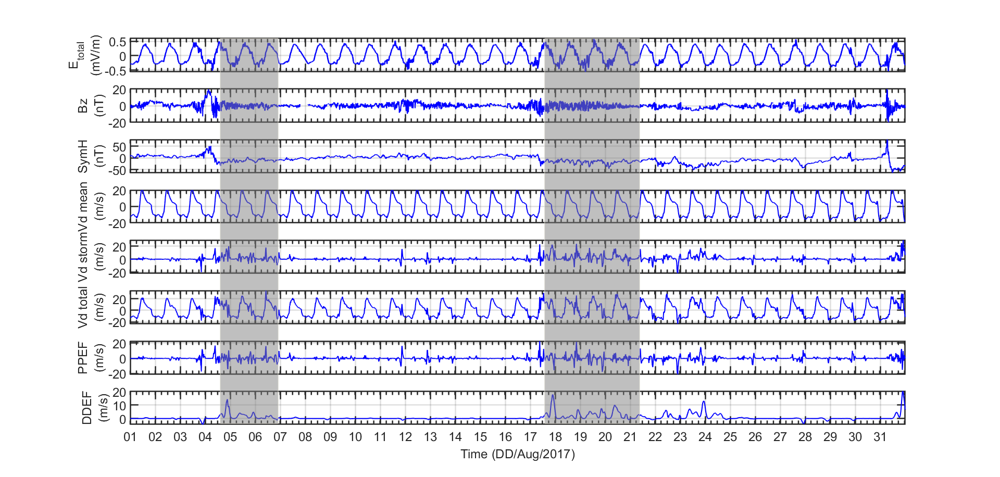

# 💫 Fejer Drift – Agosto 2017

Este repositório contém scripts MATLAB para **visualizar sinais de drift ionosférico (Vd_mean, Vd_storm, Vd_total, PPEF, DDEF)** junto com **parâmetros solares e geomagnéticos (Bz, SymH, AE, Vsw, Density, Ey)** e o **campo elétrico total de Fejer (E_total)** durante **agosto de 2017**.  
O objetivo é analisar a evolução temporal destes sinais e seu comportamento conjunto.

---

## 🛠 Tecnologias Usadas

- **MATLAB (R2019b ou superior)**
- Arquivos `.dat`, `.txt`, `.fig`, `.eps` com dados ionosféricos e OMNI
- Arquivo CSV com o modelo Fejer (`todos_PPFM`)


---

## 📂 Estrutura do Projeto

```bash
Fejer_Drift/
├── ae/
├── bin/
├── obj/
├── conversao_ae_f107/
├── dados/                 # Todos os arquivos de dados, ex: drift.dat, todos_PPFM, omni_aug_2017NaN
├── doxygen/
├── images/                # Figuras geradas pelo script
├── Plot_Drift_Ey_Evento/
├── drift.dat
└── README.md
```

⚙️ Como Executar

1. Clone o repositório:

```bash
git clone https://github.com/lauratrigo/Fejer_Drift.git
cd Fejer_Drift
```

2. Abra o MATLAB e execute o script principal:
   
```bash
run Plot_Drift_Ey_Evento/Plot_Drift_Ey_Evento.m
```

3. Os gráficos com 8 subplots serão gerados automaticamente mostrando E_total, Bz, SymH, Vd_mean, Vd_storm, Vd_total, PPEF e DDEF para agosto de 2017.
As figuras serão salvas na pasta images/.

---

## 📈 Gráfico Gerado

### Drift × Fejer
<div align="center">
  <h4><strong>Fejer Drift – E_total & Vd</strong></h4>
  
</div>

---

## 🤝 Agradecimentos

Este projeto foi desenvolvido como parte de pesquisa em Física Espacial no IP&D/UNIVAP, com apoio do grupo de estudos em ionosfera e geomagnetismo.

## 📜 Licença

Este repositório está licenciado sob MIT License. Consulte o arquivo LICENSE para mais informações.
